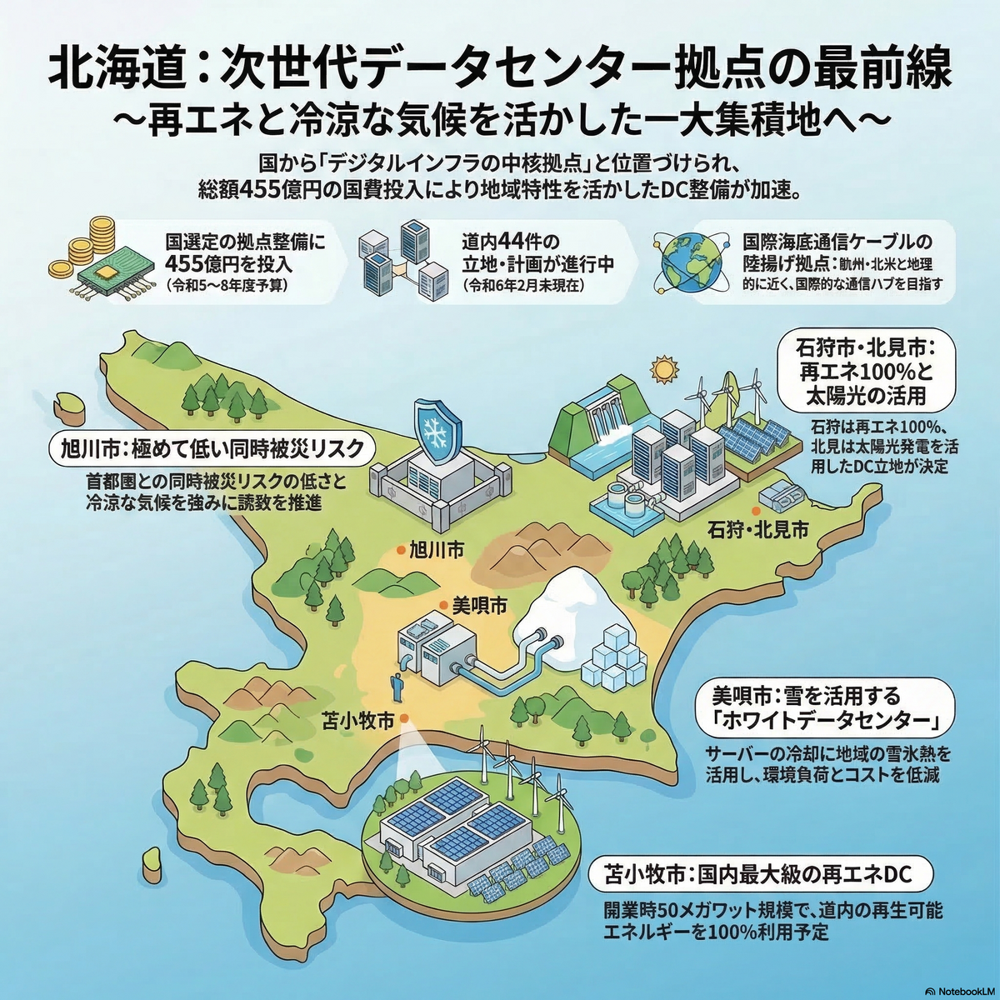
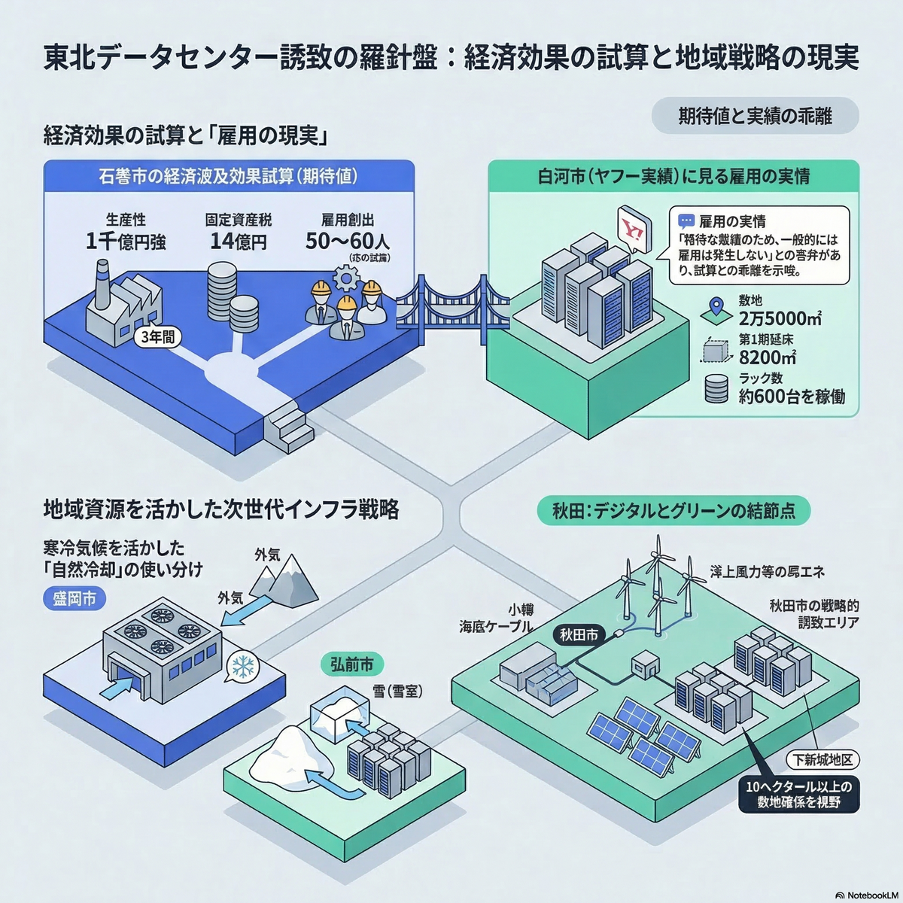
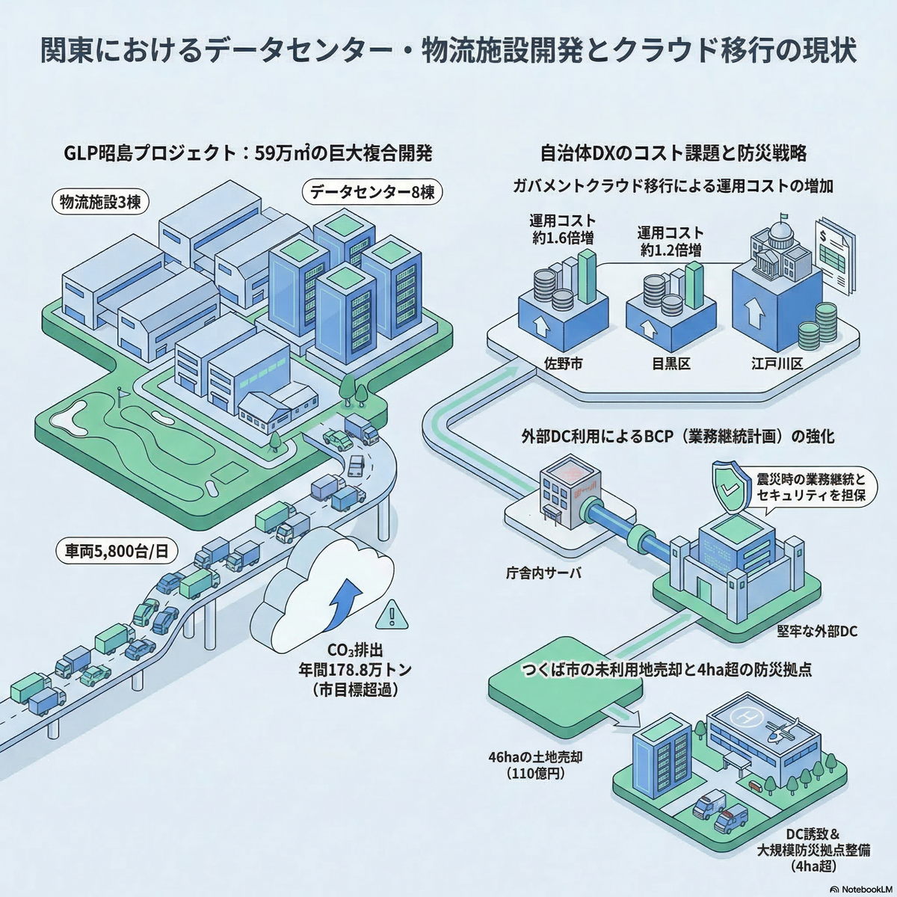
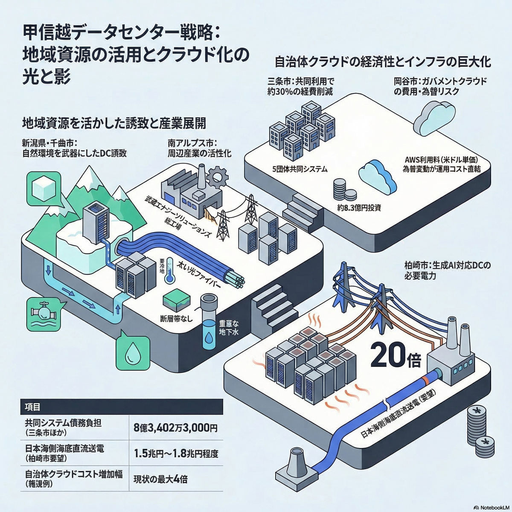
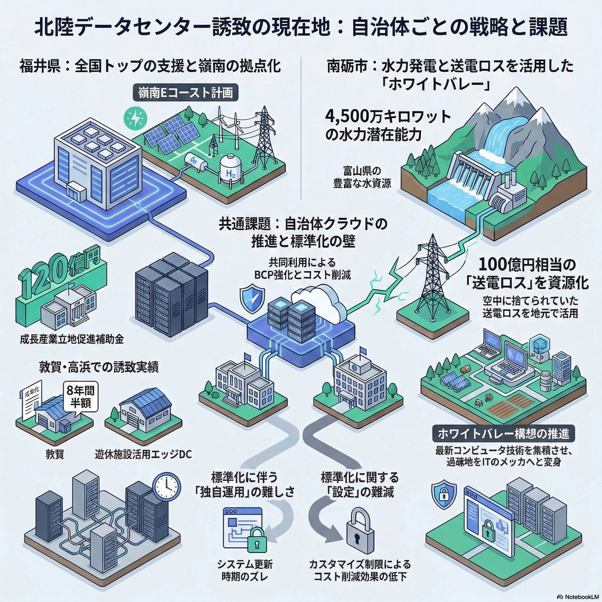
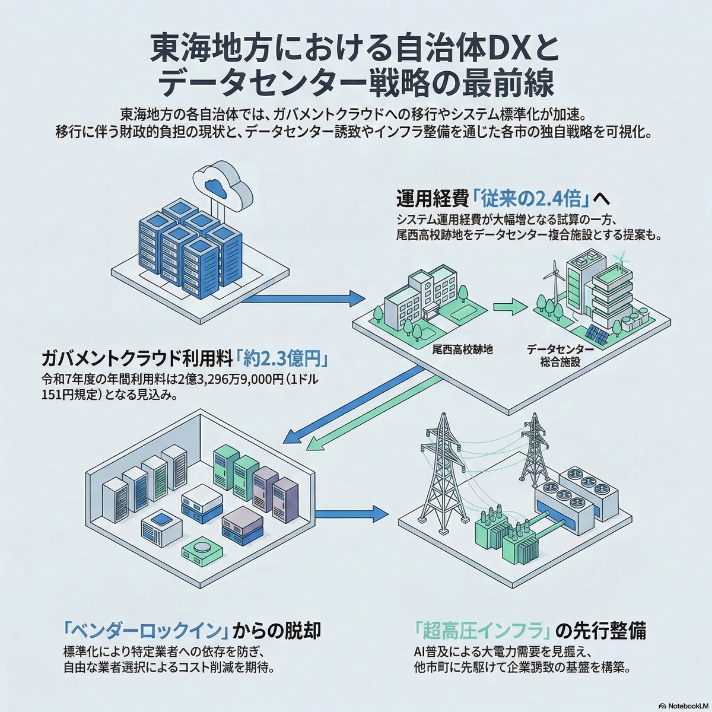
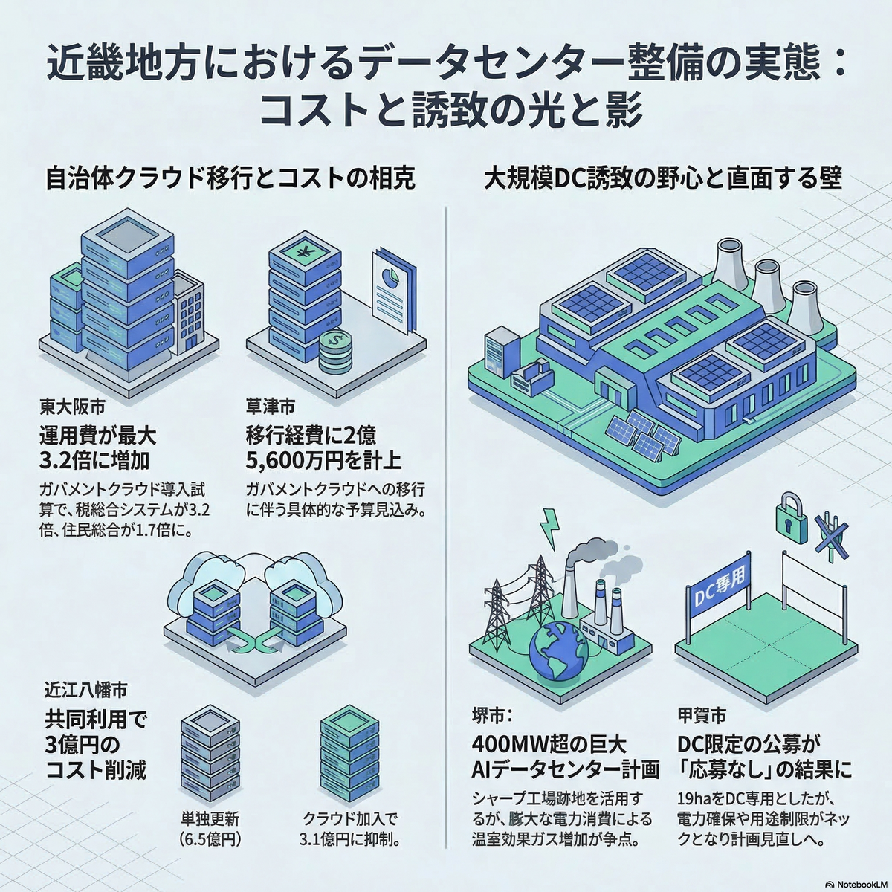
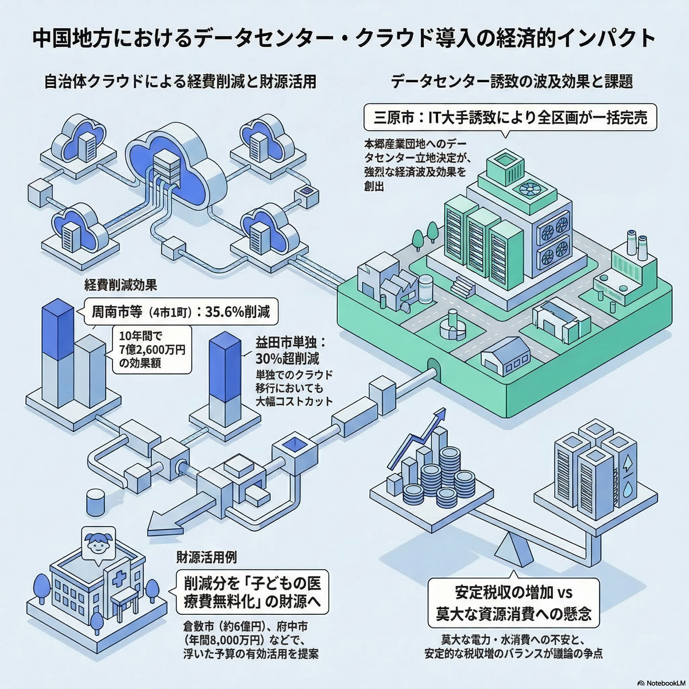
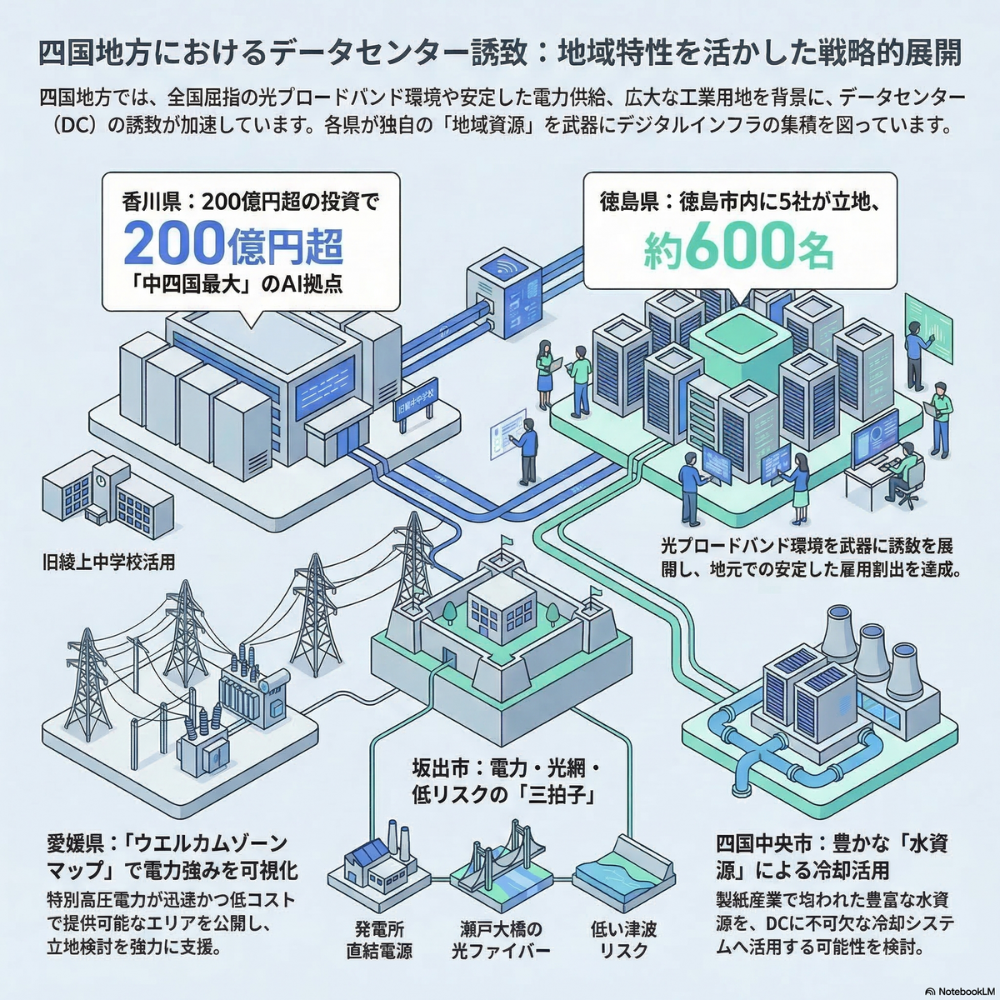
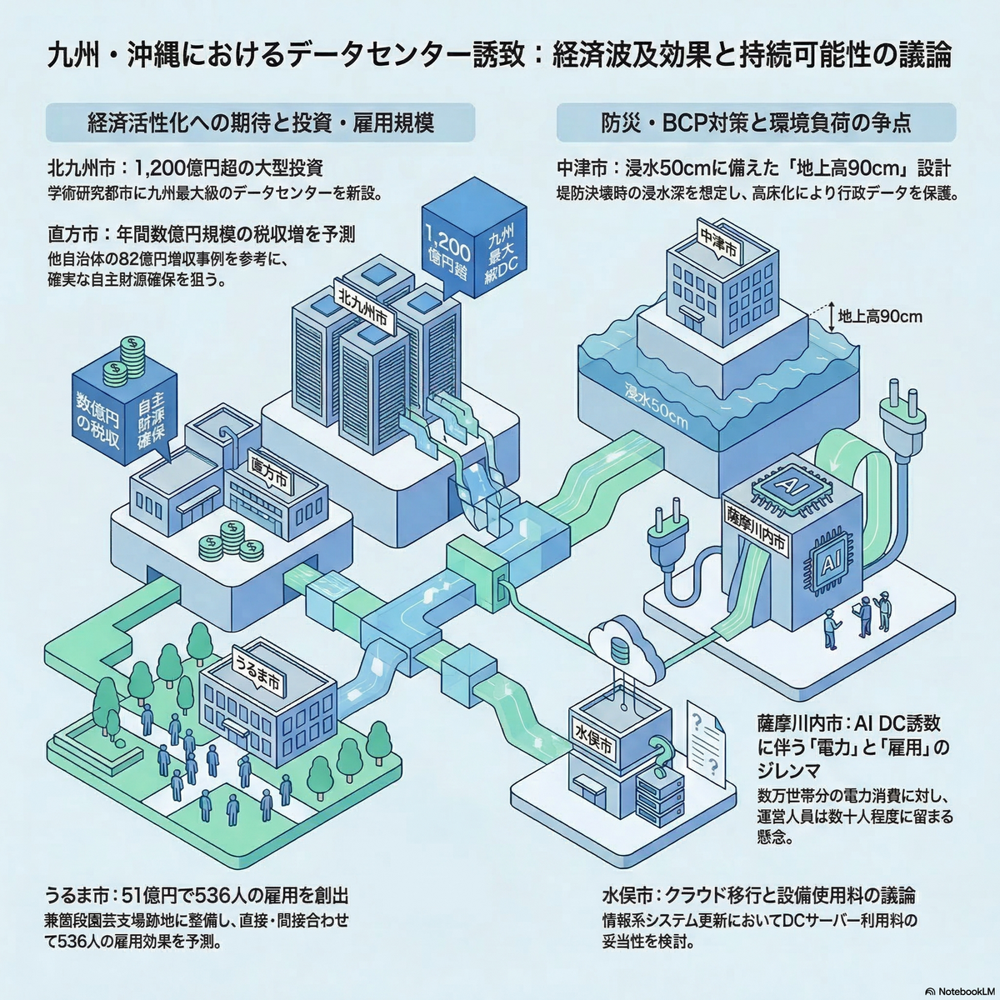

<h1>カイギアナリティクス</h1>

埋もれた議論を掘り起こし、議員の政策立案を支える。

  

    589,855
    件
    議事録データ
  

  

    約45,000
    件
    議員プロフィール
  

  

    約1,000
    自治体
    収集済み
  

## なぜ必要か

課題

地方自治体（地方公共団体）1,765で日々交わされる政策議論。その記録は議事録として公開されていますが、**自治体ごとにフォーマットがバラバラ**で、横断的な検索は事実上不可能です。

他の自治体がどのような議論を行っているか——先行事例や政策の効果を調べるには**膨大な時間と労力**が必要です。政策立案に不可欠な「全国の議論の全体像」が見えない状況が続いています。

解決

カイギアナリティクスは、WEBスクレイピング・データベース・LLM（大規模言語モデル）各技術を統合し、全国の議会議事録を収集・構造化・可視化します。多忙な議員が政策課題の全体像を一目で把握できる環境を提供します。

## 何ができるか

### 全国議事録の横断検索

キーワードを指定するだけで、全国約1,000自治体の議事録から関連する議論を抽出。地方別・自治体別に構造化して提供します。（WEBインターフェイスは準備中です。）

### 高精度な分析

AIによる要約・分析では、**ソース分離運用**と**正確性誘導プロンプト**により、ハルシネーション（事実と異なる出力）を徹底的に排除。すべての記述に出典（自治体名・日付・発言者）を明記します。

## 事例 データセンター政策分析

実際にカイギアナリティクスを使用し、「データセンター」をテーマに全国の議会議論を分析した事例です。

| 項目 | 内容 |
|---|---|
| 対象テーマ | データセンター誘致・整備に関する議論 |
| 検索対象 | 全国 381 自治体 |
| 該当議事録 | 3,296 件 |
| 生成物 | 10地方×PDF報告書 + インフォグラフィック + サマリレポート |

### 分析から得られた知見の例

発見

- **北九州市**: APL社によるデータセンター投資額 *1,250億円超*。低地震リスク・再エネ・工業用水・理工系人材の集積を強みとした誘致戦略
- **薩摩川内市**: 原発再稼働による余剰電力を活かしたデータセンター誘致。*数万世帯分の電力*を供給可能、*年間3,500万円*の税収効果を試算
- **石狩市**: さくらインターネットの石狩データセンターが*約200人*の雇用を創出。冷涼な気候による冷却コスト削減が立地優位性に

### インフォグラフィック（サンプル）

分析結果を1枚のビジュアルに凝縮したインフォグラフィックです。地方ごとの議論の全体像を一目で把握できます。

## ご利用の流れ

  

    
1

    

      <h4>テーマの設定</h4>
      
分析したい政策テーマ（キーワード）をご指定ください。

    

  

  

    
2

    

      <h4>全国議事録の横断検索</h4>
      
約1,000自治体の議事録データベースからキーワードに関連する議論を抽出します。

    

  

  

    
3

    

      <h4>構造化・分析</h4>
      
AIが議論を地方別・自治体別に構造化し、要点を分析・要約します。

    

  

  

    
4

    

      <h4>成果物の生成</h4>
      
PDF報告書、インフォグラフィック、サマリレポート、議事録データを提供します。

    

  

  

    
5

    

      <h4>納品・ブリーフィング</h4>
      
成果物をお届けし、分析結果についてご説明します。

    

  

## データ基盤

カイギアナリティクスは、独自に構築した大規模議事録データベースを基盤としています。

  

    589,855
    件
    議事録
  

  

    約45,000
    件
    議員プロフィール
  

  

    約1,000
    自治体
    収集済み（全体1,765）
  

| 構成要素 | 技術 |
|---|---|
| データベース | PostgreSQL 15（マスター＋レプリカ構成） |
| 全文検索 | Elasticsearch、Meilisearch |
| AI分析 | 各社大規模言語モデル（LLM）による構造化・要約 |
| 可視化 | NotebookLM + 画像生成モデルによるインフォグラフィック |
| 品質管理 | Anthropic ClaudeCodeによるソース分離運用 + 正確性誘導プロンプト |

---

  
お問い合わせ

  
サービスの詳細やご利用についてのご質問は、下記までお気軽にお問い合わせください。

  

    <strong>カイギアナリティクス</strong> 
    junkumagai@gmail.com
  

